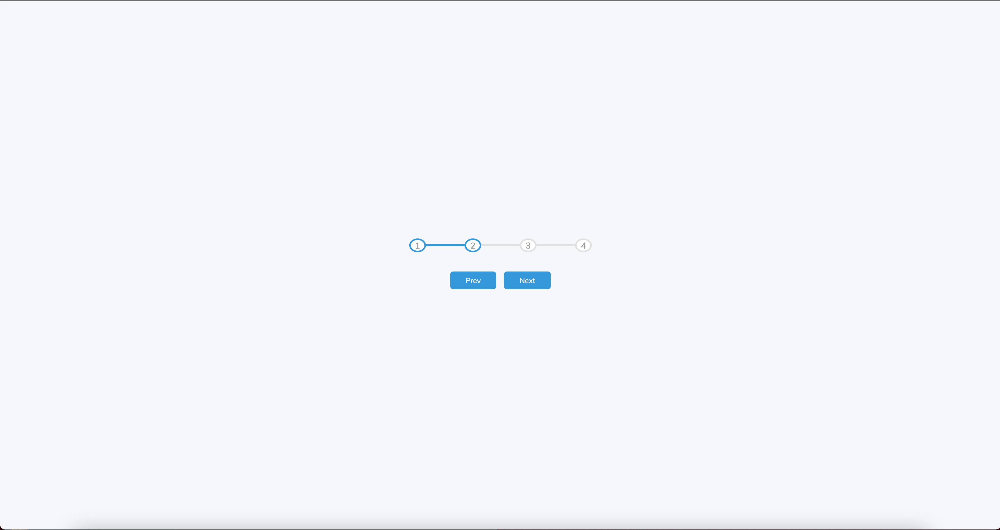
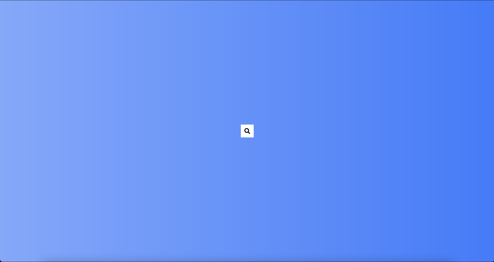
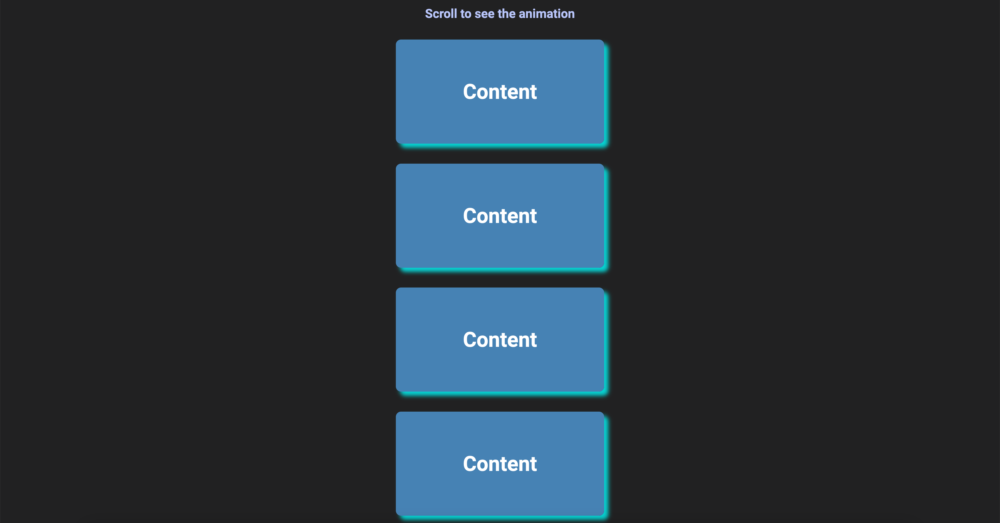

<!--
*** Thanks for checking out the 50projects50days. If you have a suggestion
*** that would make this better, please fork the repo and create a pull request
*** or simply open an issue with the tag "enhancement".
*** Thanks again! Now go create something AMAZING! :D
-->


<!-- PROJECT SHIELDS -->
<!--
*** I'm using markdown "reference style" links for readability.
*** Reference links are enclosed in brackets [ ] instead of parentheses ( ).
*** See the bottom of this document for the declaration of the reference variables
*** for contributors-url, forks-url, etc. This is an optional, concise syntax you may use.
*** https://www.markdownguide.org/basic-syntax/#reference-style-links
-->
[![Contributors][contributors-shield]][contributors-url]
[![Forks][forks-shield]][forks-url]
[![Stargazers][stars-shield]][stars-url]
[![Issues][issues-shield]][issues-url]
[![MIT License][license-shield]][license-url]
[![LinkedIn][linkedin-shield]][linkedin-url]


<!-- PROJECT LOGO -->
<br />
<p align="center">
  <a href="https://github.com/aulbytj/50projects50days">
    
  </a>

  <h3 align="center">50 Projects 50 Days</h3>

  <p align="center">
    An awesome set of projects to jumpstart your frontend coding skills!
    <br />
    <a href="https://github.com/aulbytj/50projects50days"><strong>Explore the docs »</strong></a>
    <br />
    <br />
    <a href="https://github.com/aulbytj/50projects50days/issues">Report Bug</a>
  </p>
</p>


<!-- TABLE OF CONTENTS -->
<details open="open">
  <summary>Table of Contents</summary>
  <ol>
    <li>
      <a href="#about-the-project">About The Project</a>
      <ul>
        <li><a href="#built-with">Built With</a></li>
      </ul>
    </li>
    <li>
      <a href="#getting-started">Getting Started</a>
      <ul>
        <li><a href="#installation">Installation</a></li>
      </ul>
    </li>
    <li><a href="#usage">Usage</a></li>
    <li><a href="#roadmap">Roadmap</a></li>
    <li><a href="#contributing">Contributing</a></li>
    <li><a href="#license">License</a></li>
    <li><a href="#contact">Contact</a></li>
    <li><a href="#acknowledgements">Acknowledgements</a></li>
  </ol>
</details>


<!-- ABOUT THE PROJECT -->
## About The Project

This is the 50 Projects in 50 Days, where as i will build 50 HTML, CSS and Javascript projects in 50 days, one project per day. This is from the Udemy course  [50 projects in 50 days](https://www.udemy.com/course/50-projects-50-days). It is great for beginners and seasoned Web Developers to sharpen their frontend skills.

<h3 align="center"> Expanding Cards Project</h3>
<p>
  <a href="https://expanding-cards.vercel.app/">
    
  </a>
  <p align="center">
    <a href="https://expanding-cards.vercel.app/"><strong>View Demo »</strong></a>
  </p>
</p>

<h3 align="center"> Progress Steps Project</h3>
<p>
  <a href="https://progress-steps.vercel.app/">
    
  </a>
  <p align="center">
    <a href="https://progress-steps.vercel.app/"><strong>View Demo »</strong></a>
  </p>
</p>


<h3 align="center"> Rotating Navigation Project</h3>
<p>
  <a href="https://rotating-navigation.vercel.app/">
    
  </a>
  <p align="center">
    <a href="https://rotating-navigation.vercel.app/"><strong>View Demo »</strong></a>
  </p>
</p>


<h3 align="center"> Hidden Search Project</h3>
<p>
  <a href="https://hungry-feynman-cb2b6c.netlify.app/">
    
  </a>
  <p align="center">
    <a href="https://hungry-feynman-cb2b6c.netlify.app/"><strong>View Demo »</strong></a>
  </p>
</p>


<h3 align="center"> Blurry Loading Project</h3>
<p>
  <a href="https://elated-turing-311e14.netlify.app/">
    
  </a>
  <p align="center">
    <a href="https://elated-turing-311e14.netlify.app/"><strong>View Demo »</strong></a>
  </p>
</p>


<h3 align="center"> Scroll Animation Project</h3>
<p>
  <a href="https://nostalgic-ride-b880f3.netlify.app/">
    
  </a>
  <p align="center">
    <a href="https://nostalgic-ride-b880f3.netlify.app/"><strong>View Demo »</strong></a>
  </p>
</p>


### Built With.

* HTML
* CSS
* Javascript

<!-- GETTING STARTED -->
## Getting Started

To get a local copy follow these simple steps to clone the repo.


### Installation


Clone the repo
   ```sh
   git clone https://github.com/aulbytj/50projects50days.git
   ```

<!-- USAGE EXAMPLES -->
## Usage

These projects can be used in you own small or large projects, or as a way to sharpen you skills with HTML, CSS and Javascript.

<!-- ROADMAP -->
## Roadmap

Proposed issues and fixes can be recommended here [open issues](https://github.com/aulbytj/50projects50days/issues).


<!-- CONTRIBUTING -->
## Contributing

Contributions are what make the open source community such an amazing place to be learn, inspire, and create. Any contributions you make are **greatly appreciated**.

1. Fork the Project
2. Create your Feature Branch (`git checkout -b feature/AmazingFeature`)
3. Commit your Changes (`git commit -m 'Add some AmazingFeature'`)
4. Push to the Branch (`git push origin feature/AmazingFeature`)
5. Open a Pull Request


<!-- LICENSE -->
## License

Distributed under the MIT License. See `LICENSE` for more information.


<!-- CONTACT -->
## Contact

Aulbourn Knowles - [twitter](https://twitter.com/aulbytj) - aulbourn@outlook.com

Project Link: [https://github.com/aulbytj/50projects50days](https://github.com/aulbytj/50projects50days)


<!-- ACKNOWLEDGEMENTS -->
## Acknowledgements
* [50Projects50Days Udemy Course](https://www.udemy.com/course/50-projects-50-days)
* [Traversy Media](https://www.youtube.com/user/TechGuyWeb)
* [Florin Pop](https://www.youtube.com/channel/UCeU-1X402kT-JlLdAitxSMA)


<!-- MARKDOWN LINKS & IMAGES -->
<!-- https://www.markdownguide.org/basic-syntax/#reference-style-links -->
[contributors-shield]: https://img.shields.io/github/contributors/aulbytj/50projects50days.svg?style=for-the-badge
[contributors-url]: https://github.com/aulbytj/50projects50days/graphs/contributors
[forks-shield]: https://img.shields.io/github/forks/aulbytj/50projects50days.svg?style=for-the-badge
[forks-url]: https://github.com/aulbytj/50projects50days/network/members
[stars-shield]: https://img.shields.io/github/stars/aulbytj/50projects50days.svg?style=for-the-badge
[stars-url]: https://github.com/aulbytj/50projects50days/stargazers
[issues-shield]: https://img.shields.io/github/issues/aulbytj/50projects50days.svg?style=for-the-badge
[issues-url]: https://github.com/aulbytj/50projects50days/issues
[license-shield]: https://img.shields.io/github/license/aulbytj/50projects50days.svg?style=for-the-badge
[license-url]: https://github.com/aulbytj/50projects50days/blob/master/LICENSE.txt
[linkedin-shield]: https://img.shields.io/badge/-LinkedIn-black.svg?style=for-the-badge&logo=linkedin&colorB=555
[linkedin-url]: https://linkedin.com/in/aulbytj
[product-screenshot]: images/screenshot.png
